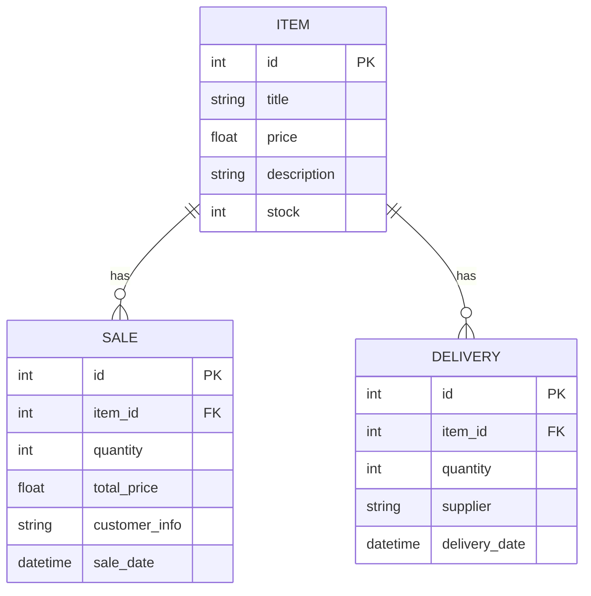

# My API

Profesjonalny projekt oparty o FastAPI ze skalowalną i modułową architekturą, wykorzystujący nowoczesny menedżer pakietów `uv`.

## 🛠 Wymagania wstępne

Projekt używa narzędzia [uv](https://docs.astral.sh/uv/) do zarządzania zależnościami i środowiskiem wirtualnym. Gwarantuje to błyskawiczną instalację środowiska oraz absolutną powtarzalność między komputerami (dzięki plikowi `uv.lock`).

Aby zacząć, zainstaluj `uv` w swoim systemie:

**PowerShell:**

```powershell
powershell -ExecutionPolicy ByPass -c "irm https://astral.sh/uv/install.ps1 | iex"
```

_(Wymagany jest także Python >= 3.11, jednak na większości systemów `uv` potrafi pobrać go sam)._

---

## 🚀 Uruchomienie projektu od zera (na każdym nowym komputerze)

Dzięki plikowi `uv.lock` środowisko zostanie odtworzone 1:1, z dokładnie tymi samymi wersjami podpakietów, których używano na innych maszynach.

### 1. Pobierz repozytorium

```bash
git clone <adres-repozytorium>
cd my-api
```

### 2. Zainstaluj środowisko

To jedno polecenie utworzy folder `.venv` i zainstaluje z pełną precyzją wszystkie pakiety oraz środowisko uruchomieniowe.

```bash
uv sync
```

### 3. Uruchom serwer

Nie musisz nawet aktywować środowiska wirtualnego komendami typu `activate`. Po prostu przekaż uruchomienie przez `uv run`:

```bash
uv run python main.py
```

Serwer zacznie nasłuchiwać pod adresem: `http://0.0.0.0:8000`.

---

## 📚 Dokumentacja API (Swagger)

FastAPI z automatu generuje niezbędną dokumentację Open API. Ze względu na zdefiniowane przekierowanie w projekcie, kiedy uruchomisz aplikację na swoim komputerze, możesz wejść na główny adres lub jeden z dedykowanych URI:

- **Swagger UI:** http://localhost:8000/docs
- **ReDoc:** http://localhost:8000/redoc

Z poziomu panelu Swagger UI możesz przetestować wszystkie napisane endpointy.

---

## Diagram encji klas domenowych


